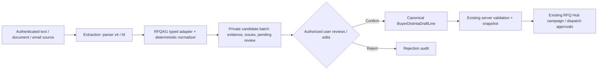

# RFQAI1 — Unified Intake Architecture & Contract (v1)

Status: **implemented as pure domain code + Parser v4 adapter; not connected to production ingestion**.

## Outcome / boundaries

Free text, Excel, PDF, forwarded emails and connected mailboxes will share **one reviewable candidate contract**, ultimately feeding the existing `BuyerDistintaDraftLine` and the BD10 editable Distinta. RFQAI1 does **not** activate AI inference, uploads, mailboxes, persistence or dispatch. No auth policy, server action, Supabase migration, RLS policy or organization role was changed.

### 1. Audit — verified existing implementation

| Component | Verified file / behavior | Reuse and gap |
| --- | --- | --- |
| Active parser | `services/worker/app/main.py` imports `ParserV31Adapter`; `services/worker/app/parser_v31.py` is a compatibility alias for **`ParserV4Adapter`** | v4 actually runs; do not perform a risky worker cutover |
| Parser observations | `services/worker/app/parser_v4.py`, `extractor_v4.py` | Emits geometry, grade, norm, quantity, source text, item role, confidence and validation metadata; **not** buyer Distinta lines |
| Document extraction | `services/worker/app/extractor_v31.py` | `pypdf` text, `openpyxl` XLSX, `xlrd` XLS and EML; flattens page/sheet/row provenance; no DOCX or image OCR |
| Upload | `services/worker/app/main.py`, `apps/web/app/(workspace)/uploads/actions.ts` | Current 25 MB, `.zip/.eml/.pdf/.xls/.xlsx`, verified session and server-to-server token; existing commercial-memory ingestion must remain separate |
| Guided Distinta | `apps/web/lib/buyer-distinta.ts`, `buyer-guided-commercial-line.ts`, `buyer-distinta-builder.tsx` | Canonical shape, kg/m, quantities, live preview, copy and complete-line calculator. Calculator **does not require norm or grade**, so intake adds stricter issues |
| Private RFQ | `apps/web/app/(public)/distinta/actions.ts`; `apps/web/app/(workspace)/rfq-hub/distinta/page.tsx` | Auth-checked saving, company write-role protected creation, RFQ Hub campaign gate; keep unchanged |
| Receiving email | Existing Resend outgoing functionality in `distinta/actions.ts` | Does **not** mean inbound receiving or mailbox linking exists. Future intake requires separate verified webhooks, isolation and opt-in |

**Consequences:** do not route a parser v4 commercial observation directly to `buyer_create_distinta_snapshot` or import supplier price as a buyer target. Preserve private evidence outside public Knowledge and never treat attached email instructions as agent commands.

### 2. Contract and ownership

Files:
- `apps/web/lib/rfq-ai-intake-contract.ts` — v1 version, typed sources, candidate schema, deterministic line normalizer, issues, evidence, limits.
- `apps/web/lib/rfq-ai-parser-v4-adapter.ts` — current worker observation adapter, zero side effects.
- `apps/web/lib/buyer-distinta.ts` — unchanged canonical commercial calculator.

A `RfqAiLineCandidate` includes:
- `contractVersion: "rfqai-intake/v1"`, `candidateId`, **opaque** `sourceId`, channel and document intent;
- untrusted parser excerpt, parser confidence, exact source locator when known; fallback `extracted_observation` (observation index, **not** invented PDF page or Excel row);
- `proposedLine` in the existing `BuyerDistintaDraftLine` shape, with norms EN 10210/EN 10219 independently per article, optional buyer target €/t, theoretical kg/m from our own deterministic mass calculator;
- per-field evidence with `origin = extracted | derived | human`, original text and locator;
- explicit issues and `status = ready_for_review | needs_review | invalid`;
- **`approvalState = pending_human_review` always**. Even a complete, high-confidence candidate is **not** approved.

`RfqAiSourceIntent` separately records `buyer_request | supplier_quote | unknown`. Non-buyer intent and non-request parser `item_role` cannot be treated as clean candidates. Quantity units are canonical `bars | meters | tonnes`; unsupported packs/units remain unresolved. **No default 12m** for imported bar lines. Missing norm, grade, dimension, length, quantity, or unknown units are visible issues. `price_value` in incoming offers is never assumed to be `targetEurT`.

The batch builder caps candidate count to **500** (matching snapshot contract) and rejects duplicate IDs. A worker may process several source files, but all observations must be mapped using the **source ID assigned by trusted ingestion**.

### 3. Intended pipeline

**Trust boundary:** the source ID, organization ID, actor ID and access rights are assigned / checked by the authenticated server, **never accepted from an AI response, forwarded email or browser input**. The pure contract contains no authorization claims. Before RFQAI2/RFQAI8, the server must enforce active organization + membership/write role, scoped private file access and tenant-isolated RLS. A future human-confirmation server action must bind the reviewer from the verified Supabase session, validate every edited line using the canonical calculator, and ensure explicit user confirmation. No automated campaign creation, email sending or cross-tenant knowledge promotion.

### 4. Technical and product edge cases

- **Mixed norms:** one EN 10210 and another EN 10219 in the same batch must produce different theoretical SHS/RHS kg/m when applicable; norms are never inherited from the previous row.
- **Three-number geometry:** ambiguous OD × wall × length vs width × height × wall must be escalated; parser v4 already emits interpretation metadata. Do not invent geometry in AI responses.
- **Units:** `30 pz` at 6m → 180m only if length is explicit; `120 m`, `0,5 t` preserve modes. `1.000` without locale context is ambiguous; `pacchi` remains unsupported pending a pack-to-piece definition.
- **Input quality:** scanned PDFs, tables flattened to text and missing locator mapping need separate OCR/table recovery in RFQAI5. Never pretend a source index is a page/row.
- **AI confidence:** parser confidence is an advisory number (0..1), not permission to autoaccept.
- **Privacy:** stored source bytes, filenames, email addresses and extracted text will require restricted retention, quotas, file scanning, prompt injection defenses and audit logging before live ingestion; RFQAI1 introduces no runtime storage path or API.

### 5. Executable microblocks and acceptance

- **RFQAI1.1 — Audit & baseline:** verify parser alias, file formats, authorization boundaries and canonical buyer validation. **Done.**
- **RFQAI1.2 — Candidate contract:** versioned typed record, explicit issues, provenance, norm-aware mass and human-review invariant. **Done.**
- **RFQAI1.3 — Parser v4 adapter:** map worker snake_case fields and validation metadata; no buyer-target price inference or fabricated locators. **Done.**
- **RFQAI1.4 — Regression and CI:** test mixtures, missing values, ambiguous units, source roles, invalid dimensions, confidence, 500 limit, no changes to existing auth actions. **Required before PR acceptance.**

### 6. Following releases (not implemented here)

RFQAI2: role-aware intake tabs and source upload UI. RFQAI3: sandboxed free-text extraction. RFQAI4: Excel sheet/row retention and mapping. RFQAI5: PDF/DOCX/OCR under resource limits. RFQAI6: enriched validation / structural ambiguity. RFQAI7: review queue and edit / accept / reject actions. RFQAI8: private persistence and RFQ Hub bridge. RFQAI9–10: inbound forwarded-email webhook and explicitly authorized mailbox connectors. RFQAI11: tenant isolation, malicious email, cost quotas and pilot benchmarks.
